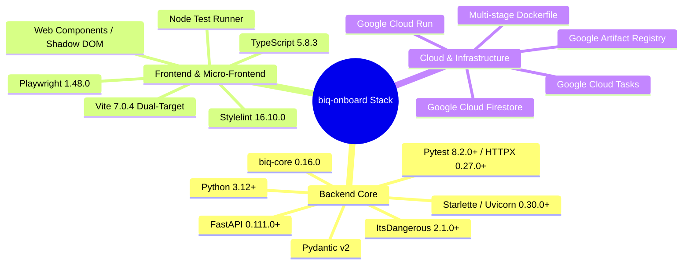
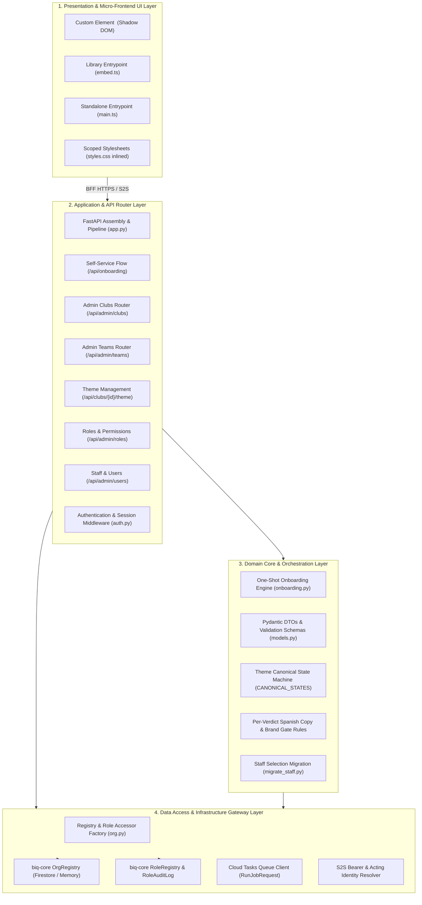
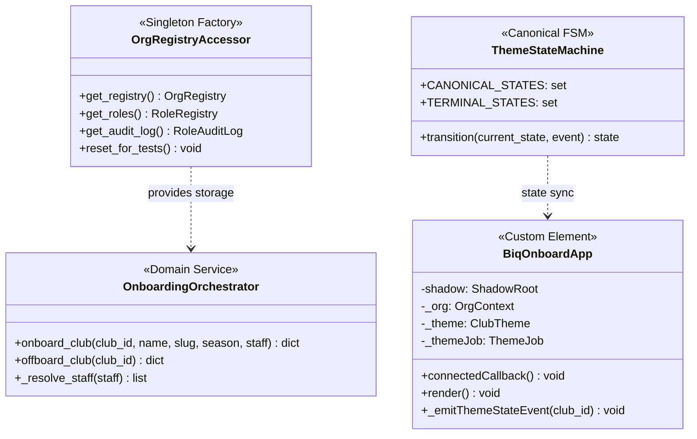
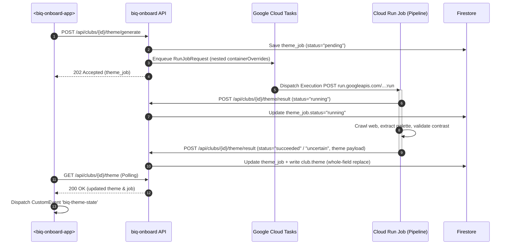
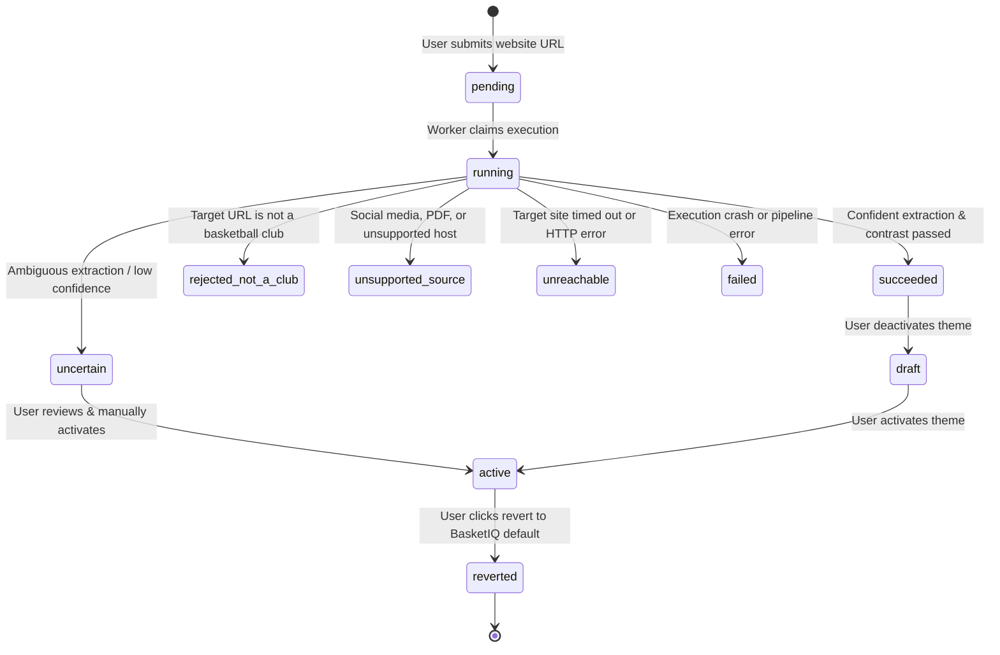
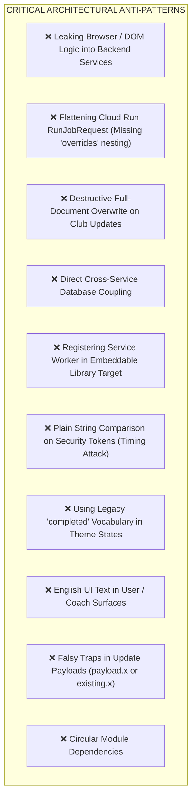

# Architecture Standards & Living Architecture — `BasketIQ/biq-onboard`

**Status:** Living Architectural Authority  
**Repository:** `BasketIQ/biq-onboard`  
**Module Type:** BasketIQ Micro-Frontend & Microservice Subsystem (Module Contract v1 · B1 Pure-Remote & Self-Hosted BFF Service)  
**Target Environment:** Python 3.12+ (FastAPI) · TypeScript 5.8+ (Web Components / Shadow DOM / Vite) · Google Cloud Run · Google Cloud Tasks · Google Cloud Firestore  

---

## 1. System Overview & Technology Stack

### 1.1 Mission & System Purpose
`biq-onboard` is the central administrative engine and onboarding microservice for the BasketIQ platform. It governs the lifecycle, organizational hierarchies, multi-tenant access control, team catalog provisioning, and automated brand/theme extraction for basketball clubs across the entire ecosystem.

It provides both a headless administrative and self-service REST API (`server/`) and an embeddable, framework-agnostic Micro-Frontend Web Component (`<biq-onboard-app>`, built from `app/`) consumed directly by the `biq-app` host shell.

```mermaid
flowchart TD
    SHELL["biq-app (Host Shell / Carcasa)"] -->|Loads Custom Element /embed/biq-onboard.js| MFE["<biq-onboard-app> (Shadow DOM)"]
    MFE -->|Dispatches CustomEvent 'biq-theme-state'| SHELL
    SHELL -->|Proxies Requests via BFF S2S Bearer + Headers| API["biq-onboard (FastAPI Service)"]
    
    API -->|Reads / Writes Org & Role Documents| DB[("Google Cloud Firestore / Memory")]
    API -->|Dispatches Asynchronous Tasks| TASKS["Google Cloud Tasks"]
    TASKS -->|POST /v2/{job}:run with containerOverrides| RUN_JOB["Cloud Run Job (@basketiq/club-theme-pipeline)"]
    RUN_JOB -->|POST /api/clubs/{id}/theme/result (HMAC token)| API
    
    PEER_PLAN["biq-season-plan"] -.->|Reads Club, Teams, Roles via biq-core| DB
    PEER_TRAIN["biq-training"] -.->|Reads Team Rosters & Staff via biq-core| DB
    PEER_CYCLE["biq-cycle"] -.->|Consumes Org Context| DB
```

### 1.2 System Boundaries & Scope

| What `biq-onboard` OWNS | What `biq-onboard` DOES NOT OWN |
|---|---|
| **Club Lifecycle & Self-Service Onboarding:** Creation, update, deactivation, and offboarding of basketball club entities. | **Player Training & Execution:** Owned by `biq-training`. |
| **Team Catalog Provisioning:** Seeding, editing, category assignment, and archiving of club teams (`babybasket` to `senior`). | **Season Planning & Drills:** Owned by `biq-season-plan` and `biq-knowledge`. |
| **User & Staff Identity:** Creation of club staff accounts, password hashing/resets, and club association. | **Global Shell Navigation & Routing:** Owned by `biq-app` (`app/shell.js`). |
| **Role & Capability Governance:** Assignment and revocation of scoped roles (`club.admin`, `roles.manage`, `roles.manage.sporting`), backed by immutable audit trails. | **Objective Progression & Learning Lifecycles:** Owned by `biq-cycle`. |
| **Club Theme Extraction & Brand Orchestration:** Asynchronous dispatch to `@basketiq/club-theme-pipeline`, color palette gating, manual overrides, and logo rights affirmation. | **Execution of Color Extraction Algorithms:** Owned by the Node pipeline inside `@basketiq/club-theme-pipeline`. |
| **`<biq-onboard-app>` Web Component:** UI for Club Details, Team Management, Roles, and Brand Theme Customization. | **Host Shell PWA Offline Caching & Global Service Worker:** Owned strictly by `biq-app`. |

---

### 1.3 Technology Stack Specification



#### Backend Technology Specifications
- **Language & Runtime:** Python `>=3.12` utilizing modern typing (`from __future__ import annotations`, union syntax `X | Y`, frozen dataclasses, explicit generic type parameters).
- **Web Framework:** FastAPI `>=0.111.0` built on Starlette and served via Uvicorn `>=0.30.0`.
- **Domain & Core Integration:** `biq-core[org]==0.16.0` providing the canonical data contracts (`Club`, `Team`, `User`, `RoleAssignment`), team catalog generation (`build_team_catalog`), cryptographic password security (`hash_password`, `verify_password`), partial updates (`merge_club_fields`), and role capability evaluation (`effective_capabilities`, `can_assign_role`).
- **Data Persistence:** Google Cloud Firestore (`google-cloud-firestore>=2.16`) for production cloud multi-tenancy; pluggable `MemoryOrgRegistry` and `MemoryRoleRegistry` for lightning-fast, zero-cloud unit and integration testing.
- **Asynchronous Task Dispatch:** Google Cloud Tasks (`google-cloud-tasks>=2.16`) orchestrating Cloud Run Jobs (`POST run.googleapis.com/v2/{job}:run`).
- **Security & Cryptography:** Constant-time HMAC token comparisons (`hmac.compare_digest`) for S2S proxy requests and worker callbacks; encrypted session cookies via `ItsDangerous 2.1.0`.

#### Frontend & Micro-Frontend Specifications
- **Language & Compilation:** TypeScript `5.8.3` compiled under `ES2022` target with bundler module resolution.
- **Component Model:** Framework-agnostic native Custom Element (`<biq-onboard-app>`) using open Shadow DOM (`attachShadow({ mode: 'open' })`) for guaranteed style and DOM encapsulation.
- **Dual Vite Build Pipeline:**
  1. *Standalone Preview Target* (`app/vite.config.ts`): Builds to `dist/app/` for standalone browser preview, local development, and end-to-end Playwright tests.
  2. *Embeddable Library Target* (`app/vite.lib.config.ts`): Builds self-contained ESM bundle `dist/embed/biq-onboard.js` with inlined CSS (`styles.css?inline`), base path `./`, zero external stylesheets, and **strictly no service worker registration**.
- **Quality & Testing:** Node.js native test runner (`node --test tests/*.test.mjs`), Stylelint `16.10.0` for CSS standard conformity, and Playwright `1.48.0` for visual snapshot validation.

---

## 2. Layer Boundaries & Clean Architecture

`biq-onboard` strictly enforces Clean Architecture and the Dependency Inversion Principle. Dependencies flow strictly **inward** toward pure domain contracts and core business rules.



### 2.1 Layer Responsibilities & Isolation Rules

#### 1. Presentation & Micro-Frontend UI Layer (`app/src/*`)
- **Responsibilities:**
  - Implements `<biq-onboard-app>` custom element registered in the browser window.
  - Manages tab navigation: "Mis clubes", "Unirme a un club", "Crear un club", "Detalles del club", "Equipos", "Roles", and "Perfil".
  - Maintains internal UI component state (loading indicators, field validation, unsaved team edits, color picker feedback).
  - Emits `biq-theme-state` `CustomEvent` (`bubbles: true`, `composed: true`) across the Shadow DOM boundary whenever club theme state changes.
- **Language & Cultural Invariant:**
  - All coach-, admin-, and user-facing text, alerts, buttons, and validation messages **must strictly be in Spanish (Spain `es-ES`)**.
  - Internal technical code symbols, property names, CSS classes, and logs remain in **English**.
- **Isolation Guarantees:**
  - Completely isolated within Shadow DOM; no leakage of styles to the parent document.
  - Never imports backend packages or Node-specific runtime modules.
  - In library mode (`dist/embed/biq-onboard.js`), never registers a Service Worker or sets global window pollution.

#### 2. Application & API Router Layer (`server/src/biq_onboard_server/routers/*`, `app.py`, `auth.py`)
- **Responsibilities:**
  - Exposes REST endpoints for administrative back-office and authenticated self-service operations.
  - Translates incoming HTTP JSON payloads into validated Pydantic models.
  - Enforces authentication (Session cookie or S2S Bearer token) and authorization gates (`club.admin`, `roles.manage`, `roles.manage.sporting`, `club.teams.manage`).
  - Handles HTTP status codes, CORS headers, and standard exception handling.
- **Isolation Guarantees:**
  - Route handlers perform validation, authorization, and dispatch; they do not contain raw SQL/NoSQL queries.
  - Bounded to transport logic; business workflows are delegated to domain orchestration functions.

#### 3. Domain Core & Orchestration Layer (`server/src/biq_onboard_server/onboarding.py`, `models.py`)
- **Responsibilities:**
  - `onboarding.py`: Implements `onboard_club()` which executes the deterministic one-shot onboarding pipeline: club creation, team catalog generation via `build_team_catalog()`, default staff generation (9 standard roles), password hashing, and role assignments.
  - Enforces domain constraints: slug validation, username formatting (`^[a-z0-9][a-z0-9_]*$`), deterministic user ID generation (`{username}_{club_id}`).
  - Maintains the canonical theme state machine (`CANONICAL_STATES`, `TERMINAL_STATES`).
- **Isolation Guarantees:**
  - Framework-agnostic business logic.
  - Pure calculation and state transformation, testable with in-memory backends.

#### 4. Data Access & Infrastructure Gateway Layer (`server/src/biq_onboard_server/org.py`)
- **Responsibilities:**
  - `org.py`: Provides unified accessors `get_registry()`, `get_roles()`, and `get_audit_log()`.
  - Dynamically binds to `FirestoreOrgRegistry` / `FirestoreRoleRegistry` in production or `MemoryOrgRegistry` / `MemoryRoleRegistry` during testing based on `BIQ_ORG_STORE` and `BIQ_ROLES_STORE`.
  - Dispatches asynchronous tasks to Google Cloud Tasks for Cloud Run Job processing.
  - Verifies cryptographically secure S2S bearer tokens and HMAC job callback secrets.
- **Isolation Guarantees:**
  - Abstracted behind `biq-core` registry interfaces. Upper layers remain unaware of the concrete persistence engine.

---

## 3. Directory & Package Structure Guidelines

The repository is structured as a cohesive monorepo separating the frontend Micro-Frontend (`app/`) and the backend microservice (`server/`):

```text
biq-onboard/
├── .devin/                               # Agent sandbox rules and workflow configs
├── .github/                              # Continuous Integration & Delivery workflows
│   ├── actions/                          # Reusable GitHub Actions (pick-runner, setup-env)
│   └── workflows/
│       └── deploy.yml                    # Automated build, test, containerize, and deploy
├── .graph/                               # Living Architecture Plane & Graph Governance
│   └── architecture.md                   # Authoritative architecture specification (this file)
├── app/                                  # Frontend Micro-Frontend source root
│   ├── index.html                        # Standalone development & preview HTML host
│   ├── package.json                      # NPM dependencies, scripts, build targets
│   ├── scripts/                          # Automated tooling (e.g. screenshot-club-step.mjs)
│   ├── src/                              # TypeScript frontend source code
│   │   ├── embed.ts                      # Library entrypoint (imports onboard-app.ts)
│   │   ├── main.ts                       # Standalone entrypoint (imports standalone.css + app)
│   │   ├── onboard-app.ts                # Main Custom Element <biq-onboard-app> (Shadow DOM)
│   │   ├── standalone.css                # Root CSS variables & tokens for preview mode
│   │   └── styles.css                    # Component styles (inlined into Shadow DOM via ?inline)
│   ├── tests/                            # Frontend unit & regression tests
│   │   ├── club-step-lifecycle.test.mjs
│   │   ├── club-tabs-f7.test.mjs
│   │   ├── teams-tab-f12.test.mjs
│   │   ├── theme-emit-gating.test.mjs
│   │   └── theme-terminal-state.test.mjs
│   ├── tsconfig.json                     # TypeScript compiler configuration (ES2022)
│   ├── vite.config.ts                    # Standalone Vite configuration (outDir: ../dist/app)
│   └── vite.lib.config.ts                # Embeddable library Vite configuration (outDir: ../dist/embed)
├── deploy/                               # Deployment configuration & IAM runbooks
│   └── iam/
│       └── staging-task-invoker.md       # Service account & Cloud Tasks IAM setup
├── docs/                                 # Living documentation & operational specifications
│   ├── draft-requisites/                 # Multi-agent architectural reviews & refinement plans
│   │   └── implementation-plan.md        # Active feature specifications and refinement trails
│   ├── reviews/                          # Retrospective gate reviews and audit closeouts
│   │   └── gate-OEE-1c-closeout-audit.md
│   └── runbooks/                         # Operational runbooks & incident prevention
│       └── club-theme-job-dispatch.md    # RunJobRequest body shape & secret coupling runbook
├── server/                               # Backend microservice root
│   ├── pyproject.toml                    # PEP 621 Python build configuration & dependencies
│   ├── src/
│   │   └── biq_onboard_server/           # Primary Python application package
│   │       ├── __init__.py               # Package version definition
│   │       ├── app.py                    # FastAPI application factory, middleware, static mount
│   │       ├── auth.py                   # Session login/logout, break-glass admin, capability check
│   │       ├── migrate_staff.py          # Staff user selection migration utilities
│   │       ├── models.py                 # Pydantic request/response DTO models
│   │       ├── onboarding.py             # Deterministic one-shot onboarding orchestration
│   │       ├── org.py                    # biq-core OrgRegistry / RoleRegistry accessor factory
│   │       └── routers/                  # Modular endpoint routers
│   │           ├── __init__.py
│   │           ├── clubs.py              # Admin Club CRUD endpoints
│   │           ├── onboarding.py         # Admin one-shot onboarding & offboarding endpoints
│   │           ├── onboarding_flow.py    # Self-service auth-then-club onboarding flow (ADDENDUM-07)
│   │           ├── roles.py              # Tiered role assignment & audit log endpoints
│   │           ├── season.py             # Active season configuration endpoints
│   │           ├── teams.py              # Org-registry team catalog management endpoints
│   │           ├── theme.py              # Club theme lifecycle, Cloud Tasks dispatch, callbacks
│   │           └── users.py              # User management & password reset endpoints
│   └── tests/                            # Backend test suite (pytest)
│       ├── conftest.py                   # Test fixtures, memory registry isolation setup
│       ├── test_api.py                   # Core API CRUD endpoint integration tests
│       ├── test_f5_gate_e2e.py           # Theme gate end-to-end tests
│       ├── test_f5_staleness_timeout.py  # Theme job timeout & staleness tests
│       ├── test_f9_role_management.py    # Tiered role assignment tests
│       ├── test_manual_activation_f6.py  # Theme manual activation tests
│       ├── test_manual_theme_f6.py       # Custom color palette override tests
│       ├── test_mutation_proofs.py       # Non-destructive field mutation proofs
│       ├── test_oee_1c.py                # OEE-1c regression tests
│       ├── test_onboarding_flow.py       # Self-service onboarding flow tests
│       ├── test_theme.py                 # Theme dispatch, RunJobRequest shape, callback tests
│       └── test_theme_entry_points_f5.py # Theme entry points & error mapping tests
├── Dockerfile                            # Multi-stage production container build (Node + Python)
├── cloudbuild.yaml                       # Google Cloud Build containerization pipeline
└── README.md                             # Service overview and local development instructions
```

---

## 4. Design Patterns, State Management & Dependency Injection



### 4.1 Pluggable Registry & Lazy Factory Pattern
- **Problem:** Tightly coupling data access to concrete Google Cloud Firestore instances prevents fast local testing, creates external cloud dependencies in CI, and risks accidental mutation of staging databases.
- **Solution:** `server/src/biq_onboard_server/org.py` implements a lazy singleton factory. It inspects `BIQ_ORG_STORE` and `BIQ_ROLES_STORE`:
  - When set to `"memory"`, it instantiates `MemoryOrgRegistry` and `MemoryRoleRegistry`.
  - When set to `"firestore"`, it lazily initializes the `google.cloud.firestore.Client` and binds to `FirestoreOrgRegistry` and `FirestoreRoleRegistry`.
  - Test suites call `reset_for_tests()` in `conftest.py` fixtures to guarantee clean state isolation between test cases.

### 4.2 Dual-Path Authentication & Identity Resolution Pattern
- **Problem:** The service is accessed via two distinct network channels: (1) Direct standalone browser sessions for admin operators, and (2) Cross-origin BFF proxy requests from `biq-app` on behalf of authenticated coaches and directors.
- **Solution:** Centralized identity resolution via `_resolve_acting_identity()`:
  1. **S2S (Service-to-Service) Channel:** When `BIQ_ONBOARD_S2S_SECRET` is configured, requests must supply `Authorization: Bearer <secret>`. The secret is validated via constant-time comparison (`hmac.compare_digest`). The acting user ID and email are extracted from `X-BIQ-Acting-User-Id` and `X-BIQ-Acting-Email` headers. If the token is invalid or missing, the endpoint fails-closed with `401 Unauthorized`.
  2. **Standalone Session Channel:** When no S2S secret is configured, identity falls back to encrypted session cookies via `session_user(request)`.
  3. **Break-Glass Admin:** An environment credential (`BIQ_ONBOARD_USER` / `BIQ_ONBOARD_PASSWORD`) provides a break-glass access pathway for initial setup and disaster recovery.

### 4.3 Tiered Capability-Based Authorization Pattern
- **Problem:** Role-based access control often collapses into coarse-grained binary checks (e.g. `is_admin`), granting non-technical users dangerous permissions or preventing directors from managing their coaches.
- **Solution:** Tiered capability evaluation powered by `biq_core.roles.effective_capabilities`:
  - **`club.admin` & `roles.manage` (Administrator):** Unrestricted management of all club settings, team catalogs, user accounts, and role assignments.
  - **`roles.manage.sporting` (Sports Director):** Permitted to assign and revoke sporting roles (`coordinator`, `coach`, `player`), but strictly forbidden from assigning administrative roles (`administrator`, `sports_director`).
  - **`club.teams.manage`:** Allows Sports Directors and Administrators to create, edit, and archive teams in the club catalog without requiring global role management permissions.
  - Every role modification records an immutable `RoleChangeAudit` entry via `RoleAuditLog`.

### 4.4 Out-of-Process Task Dispatch & Cloud Run Job Orchestration Pattern
- **Problem:** Club theme extraction involves heavy web crawling, image processing, and color clustering algorithms in Node.js, which would block the Python FastAPI event loop and exceed Cloud Run web request timeout limits.
- **Solution:** Asynchronous orchestration via Google Cloud Tasks:
  1. The client requests theme generation (`POST /api/clubs/{club_id}/theme/generate`).
  2. `biq-onboard` initializes `theme_job.status = "pending"` and enqueues a Cloud Tasks HTTP target task.
  3. **Critical Payload Invariant:** The task targets `POST run.googleapis.com/v2/{job}:run`. The Cloud Run Admin API v2 `RunJobRequest` requires `containerOverrides` to be strictly nested under `overrides`:
     ```json
     {
       "overrides": {
         "containerOverrides": [
           {
             "env": [
               { "name": "CLUB_ID", "value": "cb_norte" },
               { "name": "HOMEPAGE_URL", "value": "https://cbnorte.es" }
             ]
           }
         ]
       }
     }
     ```
  4. The job container executes independently and reports completion back to `POST /api/clubs/{club_id}/theme/result`.
  5. The result callback is authenticated using a dedicated constant-time token `BIQ_THEME_JOB_RESULT_TOKEN`.



### 4.5 Canonical Club Theme State Machine
The theme generation lifecycle adheres to a deterministic, non-conflicting state machine:



- **Canonical States (`CANONICAL_STATES`):** `pending`, `running`, `succeeded`, `uncertain`, `rejected_not_a_club`, `unsupported_source`, `unreachable`, `failed`, `reverted`.
- **Vocabulary Guard:** The ambiguous keyword `"completed"` is **strictly prohibited**. Success is represented explicitly as `"succeeded"`.
- **Map-Replacement Semantics:** Replacing `theme` or `theme_job` writes a whole-field dictionary replacement to Firestore, preventing lingering zombie fields from prior runs.

### 4.6 Non-Destructive Field Patching Pattern (`merge_club_fields`)
- **Problem:** Updating club basic info (name, short_name) with naive document overwrites wipes out concurrently updated fields such as `website`, `theme`, `theme_job`, `deactivated_at`, or `created_by`.
- **Solution:** Endpoints utilize `registry.merge_club_fields(club_id, fields)` (introduced in `biq-core 0.12.0+`), ensuring only explicitly submitted fields are patched in the database while leaving all other club metadata untouched.

### 4.7 Reactive Host-Shell State Synchronization via Composed CustomEvents
- **Problem:** The `<biq-onboard-app>` Web Component lives inside a Shadow DOM. Standard DOM events do not propagate across the Shadow root boundary, leaving the host shell unaware of theme activations.
- **Solution:** The component dispatches a bubbled, composed custom event:
  ```typescript
  this.dispatchEvent(
    new CustomEvent('biq-theme-state', {
      detail: {
        clubId: clubId,
        state: this._themeJob?.status || '',
        themeStatus: this._theme?.status || '',
      },
      bubbles: true,
      composed: true,
    })
  );
  ```
- **Event Gating:** To prevent infinite update loops and redundant network fetches, `_emitThemeStateEvent()` is centralized within `loadThemeData()` and only fires when `prevStatus !== newStatus` or `prevThemeStatus !== newThemeStatus`.

---

## 5. Architectural Constraints & Anti-Patterns

To maintain system stability, security, and long-term maintainability, all code submitted to `BasketIQ/biq-onboard` must strictly comply with these inviolable architectural constraints. Pull requests violating these rules will be rejected.



### 5.1 Anti-Pattern 1: Leaking Browser or UI Logic into Domain / Backend
- **Violation:** Importing HTML parsers, UI frameworks, DOM models, or browser-specific objects inside `server/src/biq_onboard_server/*`.
- **Enforcement:** The backend remains a headless HTTP/JSON service. Domain entities must rely solely on Python standard libraries and `biq-core`.

### 5.2 Anti-Pattern 2: Prohibited `RunJobRequest` Body Flattening
- **Violation:** Placing `containerOverrides` at the top level of the Cloud Tasks dispatch body.
- **Enforcement:** Google Cloud Run Admin API v2 silently drops top-level `containerOverrides` with `INVALID_ARGUMENT`, freezing tasks in `"pending"` forever. Dispatch payloads **must** nest `containerOverrides` under `overrides`:
  ```python
  # CORRECT:
  body = {"overrides": {"containerOverrides": [container_override]}}
  # FORBIDDEN:
  # body = {"containerOverrides": [container_override]}
  ```
  Unit tests (`test_enqueue_production_calls_cloud_tasks`) must decode and assert the JSON payload structure.

### 5.3 Anti-Pattern 3: Destructive Document Overwrites on Partial Updates
- **Violation:** Calling `registry.upsert_club(Club(...))` during partial updates (`PUT /api/admin/clubs/{id}`), which overwrites unmentioned fields with default/null values.
- **Enforcement:** Partial updates must use `registry.merge_club_fields(club_id, fields)`. All mutations are verified by regression tests in `test_mutation_proofs.py`.

### 5.4 Anti-Pattern 4: Direct Uncontrolled Cross-Service Database Access
- **Violation:** Peer services directly writing to `orgs_clubs` Firestore collections without going through `biq-onboard` or `biq-core` abstractions.
- **Enforcement:** `biq-onboard` is the sole authoritative writer for club lifecycle and theme state. Peer services access data in a read-only fashion through `biq-core` or via authenticated S2S APIs.

### 5.5 Anti-Pattern 5: Service Worker Registration in Embeddable Library Target
- **Violation:** Registering a Service Worker inside `app/src/onboard-app.ts` or `app/src/embed.ts`.
- **Enforcement:** The embeddable bundle `dist/embed/biq-onboard.js` is designed to run inside the `biq-app` host shell. The host shell exclusively owns the Service Worker and offline caching lifecycle. Embedding a secondary service worker causes cache poisoning and lifecycle collisions.

### 5.6 Anti-Pattern 6: Insecure Timing Attacks or String Equality on Security Tokens
- **Violation:** Validating bearer tokens or job callback secrets using plain equality (`token == secret`).
- **Enforcement:** All token comparisons must use constant-time comparison `hmac.compare_digest(token, secret)` to eliminate timing attack vulnerabilities.

### 5.7 Anti-Pattern 7: Non-Canonical Theme Job States or Incompatible Vocabulary
- **Violation:** Emitting or accepting states like `"completed"`, `"finished"`, `"in_progress"`, or `"error"`.
- **Enforcement:** States must strictly belong to `CANONICAL_STATES`: `pending`, `running`, `succeeded`, `uncertain`, `rejected_not_a_club`, `unsupported_source`, `unreachable`, `failed`, `reverted`.

### 5.8 Anti-Pattern 8: English UI Copy in User/Coach Facing Surfaces
- **Violation:** Hardcoding English text in `<biq-onboard-app>` user interfaces (e.g. `"Submit"`, `"Active"`, `"Club confirmed"`).
- **Enforcement:** All user-facing UI labels, descriptions, and buttons must be in **Spanish (Spain `es-ES`)** (e.g. `"Activo"`, `"Club confirmed"` $\rightarrow$ `"Club confirmado"`, `"Guardar"`), matching `VERDICT_COPY`, `THEME_JOB_COPY`, and `CATEGORY_LABELS`.

### 5.9 Anti-Pattern 9: Falsy Traps in Update Payloads
- **Violation:** Writing update logic such as `name = payload.name or existing.name`.
- **Enforcement:** Falsy checking prevents clearing optional string fields or updating boolean/zero values. Code must explicitly check `if payload.name is not None:`.

### 5.10 Anti-Pattern 10: Circular Module Dependencies
- **Violation:** Cross-importing between `routers/clubs.py` ↔ `routers/theme.py` or `auth.py` ↔ `routers/onboarding_flow.py`.
- **Enforcement:** Dependencies must flow strictly acyclically:
  $$\text{models} \longrightarrow \text{org} \longrightarrow \text{onboarding} \longrightarrow \text{auth} \longrightarrow \text{routers} \longrightarrow \text{app}$$

---

## 6. Definition of Architectural Done (DoD)

Before any feature, refactoring, or modernization pull request is approved in `BasketIQ/biq-onboard`, the following architectural gates must be verified:

1. **Layer Boundary Verification:** The Python domain logic remains decoupled from presentation concerns; the frontend Web Component remains decoupled from host shell internals.
2. **Dual-Build Verification:** Both `npm run build` (standalone preview) and `npm run build:lib` (embeddable ESM bundle) compile cleanly with zero TypeScript errors.
3. **Payload Structure Compliance:** Any Cloud Tasks dispatch payload explicitly asserts the nested `overrides.containerOverrides` structure.
4. **Security & Timing Safety:** All S2S authorization and worker callbacks verify tokens using `hmac.compare_digest` with fail-closed behavior.
5. **Cultural & Linguistic Compliance:** All new or updated UI copy is fully localized in Spanish (`es-ES`).
6. **Living Documentation Synchronization:** Any schema change, state machine transition, or API contract modification is immediately updated in `.graph/architecture.md`.
